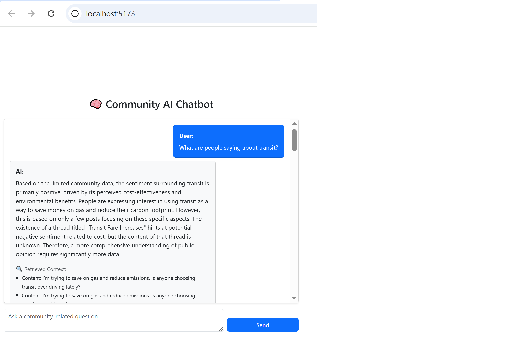

# 🧠 Agentic Community Engagement Server

This is the backend for a full-stack Agentic RAG (Retrieval-Augmented Generation) application designed to help users ask natural language questions about transit and other community concerns in Toronto. It performs semantic search over a MongoDB collection of embedded community posts and uses Gemini 2.0 Flash to generate responses and follow-up questions.

---

## 🌐 Tech Stack

| Component     | Tech                         |
|---------------|------------------------------|
| Server        | Node.js + Express            |
| API Style     | GraphQL with Apollo Server   |
| LLM           | Gemini 2.0 Flash             |
| Embeddings    | Gemini `embedding-001`       |
| Database      | MongoDB (Community Edition)  |
| ORM           | Mongoose                     |
| Auth          | User model with roles        |

---

## 📁 Folder Structure

```
community-engagement-service/
│
├── graphql/
│   ├── typeDefs.js
│   └── resolvers.js
│
├── models/
│   ├── User.js
│   ├── CommunityPost.js
│   └── UserInteraction.js
│
├── utils/
│   ├── cosineSimilarity.js
│   └── embedding.js
│
├── config/
│   ├── config.js
│   └── mongoose.js
│
├── data/
│   └── community_posts.txt
│
├── seedCommunityPosts.js
├── community-engagement-service.js
└── .env
```

---

## ⚙️ Setup Instructions

### 1. Clone the repository and install dependencies

```bash
git clone https://github.com/your-username/community-engagement-service.git
cd community-engagement-service
npm install
```

---

### 2. Configure Environment Variables

Create a `.env` file in the root with the following:

```env
GEMINI_API_KEY=your-gemini-api-key
MONGO_URI=mongodb://localhost:27017/community-engagement-lab-db-v2
```

---

### 3. Seed the Database

Seed community posts with embeddings before running the app:

```bash
node seedCommunityPosts.js
```

> ⚠️ Be aware of Gemini API’s free tier limit (15 requests/min).

---

### 4. Run the Server

```bash
npm run dev
```

Server will be available at:  
📍 `http://localhost:5000/graphql`

---

## 🚀 Features

- ✅ Semantic search over embedded community discussion posts
- ✅ Agentic RAG architecture (multi-turn with user memory)
- ✅ Factual grounding via Gemini embeddings + cosine similarity
- ✅ Dynamic follow-up questions using heuristic logic
- ✅ Stores user interactions (query + AI response)
- ✅ GraphQL API with Apollo Server
- ✅ Modular and modern ES2023+ syntax (Spring 2025 best practices)

---

## 🧪 Optional Scripts

To re-seed posts:

```bash
node seedCommunityPosts.js
```

To run the server without `nodemon`:

```bash
npm start
```

---

## 📸 Screenshot



---

## 📜 License

MIT License
